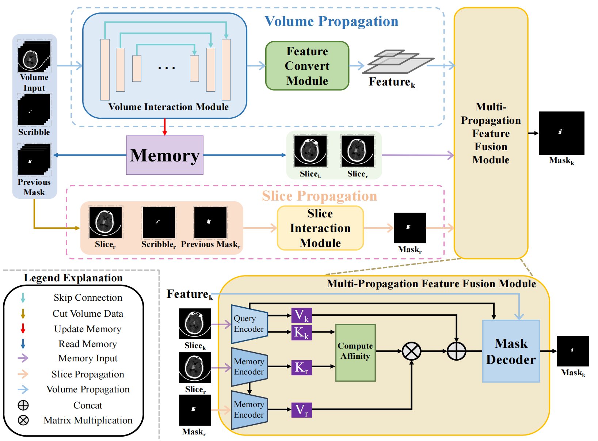
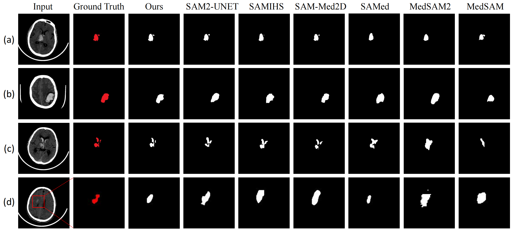

# ICH-HPINet: A Hybrid Propagation Interaction Network for Intelligent and Interactive 3D Intracerebral Hemorrhage Segmentation

## Architecture of Our Proposed Model


## File Tree
```
└─data
    -- data_get
└─evaluation
    -- evaluate the metric
└─networks
    -- the model
└─main.py
└─utils.py
└─interact.py
└─config.py
```

## Dataset
The private dataset contains 286 cases, while the [Physionet](https://physionet.org/content/ct-ich/1.3.1/#files-panel) dataset contains 75 cases. Each case consists of a volume CT data and a volume mask data. During training, the data are splited through five-fold cross-validation.

## Train
You can run it through the following command: 
```
python main.py
```

## Experiment Results
### Comparative Experiment
#### Table 1
<table align="center">
  <thead>
    <tr>
      <th rowspan="2">Method</th>
      <th colspan="4">Private Dataset</th>
      <th colspan="4">Physionet Dataset</th>
      <th rowspan="2">FLOPs↓</th>
      <th rowspan="2">Params↓</th>
    </tr>
    <tr>
      <th>Dice↑</th>
      <th>Jaccard↑</th>
      <th>HD↓</th>
      <th>MAE↓</th>
      <th>Dice↑</th>
      <th>Jaccard↑</th>
      <th>HD↓</th>
      <th>MAE↓</th>
    </tr>
  </thead>
  <tbody>
    <tr>
      <td>SAMed</td>
      <td>0.5308</td>
      <td>0.4177</td>
      <td>4.06</td>
      <td>0.0064</td>
      <td>0.4146</td>
      <td>0.3406</td>
      <td>5.17</td>
      <td>0.0145</td>
      <td>162.35G</td>
      <td>93.74M</td>
    </tr>
    <tr>
      <td>SAM-Med2D</td>
      <td>0.6276</td>
      <td>0.5018</td>
      <td>4.21</td>
      <td>0.0083</td>
      <td>0.6495</td>
      <td>0.5280</td>
      <td>4.04</td>
      <td>0.0059</td>
      <td>198.32G</td>
      <td>102.35M</td>
    </tr>
    <tr>
      <td>SAM2-UNet</td>
      <td>0.5557</td>
      <td>0.4469</td>
      <td>3.62</td>
      <td>0.0063</td>
      <td>0.4363</td>
      <td>0.3439</td>
      <td>3.95</td>
      <td>0.0036</td>
      <td>215.93G</td>
      <td>216.40M</td>
    </tr>
    <tr>
      <td>SAMIHS</td>
      <td>0.6681</td>
      <td>0.5504</td>
      <td>3.63</td>
      <td>0.0042</td>
      <td>0.5819</td>
      <td>0.4546</td>
      <td>3.62</td>
      <td>0.0035</td>
      <td>878.66G</td>
      <td>432.2M</td>
    </tr>
    <tr>
      <td>MedSAM</td>
      <td>0.5932</td>
      <td>0.4650</td>
      <td>4.26</td>
      <td>0.0065</td>
      <td>0.5292</td>
      <td>0.3978</td>
      <td>5.06</td>
      <td>0.0185</td>
      <td>365.32G</td>
      <td>298.51M</td>
    </tr>
    <tr>
      <td>MedSAM2</td>
      <td>0.5044</td>
      <td>0.3953</td>
      <td>4.07</td>
      <td>0.0069</td>
      <td>0.6978</td>
      <td>0.5987</td>
      <td>4.00</td>
      <td>0.0055</td>
      <td>671.23G</td>
      <td>455.62M</td>
    </tr>
    <tr>
      <td><strong>ICH-HPINet (Ours)</strong></td>
      <td><strong>0.7797</strong></td>
      <td><strong>0.6532</strong></td>
      <td><strong>3.59</strong></td>
      <td><strong>0.0035</strong></td>
      <td><strong>0.7467</strong></td>
      <td><strong>0.6094</strong></td>
      <td><strong>2.96</strong></td>
      <td><strong>0.0022</strong></td>
      <td>325.32G</td>
      <td>317.20.4M</td>
    </tr>
  </tbody>
</table>

Our approach demonstrated significant improvements on both our private and public datasets, enhancing Dice, Jaccard, HD, and MAE scores by at least 0.1116, 0.1028, 0.03, and 0.0007, respectively, on the private dataset, and 0.0489, 0.0107, 0.66 and 0.0013 on the Physionet dataset. Even with fewer annotations, our method consistently achieves optimal results, demonstrating its superiority.

### Ablation Experiment
#### Table 2: Propagation-based Ablation Experiment
<table align="center">
  <thead>
    <tr>
      <th rowspan="2">Method</th>
      <th colspan="4">Private Dataset</th>
      <th colspan="4">Physionet Dataset</th>
    </tr>
    <tr>
      <th>Dice↑</th>
      <th>Jaccard↑</th>
      <th>HD↓</th>
      <th>MAE↓</th>
      <th>Dice↑</th>
      <th>Jaccard↑</th>
      <th>HD↓</th>
      <th>MAE↓</th>
    </tr>
  </thead>
  <tbody>
    <tr>
      <td>Volume-Pro</td>
      <td>0.6554</td>
      <td>0.5255</td>
      <td>5.96</td>
      <td>0.0050</td>
      <td>0.6351</td>
      <td>0.5152</td>
      <td>4.29</td>
      <td>0.0180</td>
    </tr>
    <tr>
      <td>Slice-Pro</td>
      <td>0.6468</td>
      <td>0.5202</td>
      <td>4.26</td>
      <td>0.0054</td>
      <td>0.4587</td>
      <td>0.3728</td>
      <td>5.45</td>
      <td>0.0148</td>
    </tr>
    <tr>
      <td><strong>ICH-HPINet (Ours)</strong></td>
      <td><strong>0.7797</strong></td>
      <td><strong>0.6532</strong></td>
      <td><strong>3.59</strong></td>
      <td><strong>0.0035</strong></td>
      <td><strong>0.7467</strong></td>
      <td><strong>0.6094</strong></td>
      <td><strong>2.96</strong></td>
      <td><strong>0.0022</strong></td>
    </tr>
  </tbody>
</table>

The hybrid strategy improved Dice, Jaccard, HD, and MAE scores by at least 0.1243, 0.1277, 0.73, and 0.00143 on the private dataset, and 0.1116, 0.0942, 1.33, and 0.01255 on the Physionet dataset, respectively.

#### Table 3: Loss Hyperparameter Analysis on Cross Entropy Loss and Dice Loss
<table align="center">
  <thead>
    <tr>
      <th rowspan="2">Cross Entropy Loss</th>
      <th rowspan="2">Dice Loss</th>
      <th colspan="4">Private Dataset</th>
      <th colspan="4">Physionet Dataset</th>
    </tr>
    <tr>
      <th>Dice↑</th>
      <th>Jaccard↑</th>
      <th>HD↓</th>
      <th>MAE↓</th>
      <th>Dice↑</th>
      <th>Jaccard↑</th>
      <th>HD↓</th>
      <th>MAE↓</th>
    </tr>
  </thead>
  <tbody>
    <tr>
      <td>0.2</td>
      <td>1.8</td>
      <td>0.7306</td>
      <td>0.5868</td>
      <td>3.71</td>
      <td>0.0039</td>
      <td>0.7069</td>
      <td>0.5271</td>
      <td>3.62</td>
      <td>0.0041</td>
    </tr>
    <tr>
      <td>0.4</td>
      <td>1.6</td>
      <td>0.7354</td>
      <td>0.6048</td>
      <td>3.76</td>
      <td>0.0039</td>
      <td>0.6907</td>
      <td>0.5160</td>
      <td>3.64</td>
      <td>0.0042</td>
    </tr>
    <tr>
      <td>0.6</td>
      <td>1.4</td>
      <td>0.7534</td>
      <td>0.6328</td>
      <td>3.68</td>
      <td>0.0036</td>
      <td>0.7141</td>
      <td>0.5601</td>
      <td>3.26</td>
      <td>0.0033</td>
    </tr>
    <tr>
      <td>0.8</td>
      <td>1.2</td>
      <td>0.7649</td>
      <td>0.6514</td>
      <td>3.63</td>
      <td><strong>0.0034</strong></td>
      <td>0.7290</td>
      <td>0.5748</td>
      <td>3.16</td>
      <td>0.0030</td>
    </tr>
    <tr>
      <td>1.0</td>
      <td>1.0</td>
      <td><strong>0.7797</strong></td>
      <td><strong>0.6532</strong></td>
      <td><strong>3.59</strong></td>
      <td>0.0035</td>
      <td><strong>0.7467</strong></td>
      <td><strong>0.6094</strong></td>
      <td><strong>2.96</strong></td>
      <td><strong>0.0022</strong></td>
    </tr>
    <tr>
      <td>1.2</td>
      <td>0.8</td>
      <td>0.7288</td>
      <td>0.5953</td>
      <td>3.63</td>
      <td>0.0038</td>
      <td>0.7197</td>
      <td>0.5717</td>
      <td>3.14</td>
      <td>0.0031</td>
    </tr>
    <tr>
      <td>1.4</td>
      <td>0.6</td>
      <td>0.7334</td>
      <td>0.6022</td>
      <td>3.62</td>
      <td>0.0039</td>
      <td>0.6710</td>
      <td>0.5438</td>
      <td>3.23</td>
      <td>0.0037</td>
    </tr>
    <tr>
      <td>1.6</td>
      <td>0.4</td>
      <td>0.7423</td>
      <td>0.6139</td>
      <td>3.66</td>
      <td>0.0038</td>
      <td>0.6989</td>
      <td>0.5548</td>
      <td>3.18</td>
      <td>0.0033</td>
    </tr>
    <tr>
      <td>1.8</td>
      <td>0.2</td>
      <td>0.7152</td>
      <td>0.5837</td>
      <td>3.64</td>
      <td>0.0039</td>
      <td>0.6715</td>
      <td>0.5199</td>
      <td>3.53</td>
      <td>0.0040</td>
    </tr>
  </tbody>
</table>

#### Table 4: Loss Hyperparameter Analysis on lambda_1, lambda_2 and lambda_3.
<table align="center">
  <thead>
    <tr>
      <th rowspan="2">lambda_1</th> 
      <th rowspan="2">lambda_2</th>
      <th rowspan="2">lambda_3</th>
      <th colspan="4">Private Dataset</th>
      <th colspan="4">Physionet Dataset</th>
    </tr>
    <tr>
      <th>Dice↑</th>
      <th>Jaccard↑</th>
      <th>HD↓</th>
      <th>MAE↓</th>
      <th>Dice↑</th>
      <th>Jaccard↑</th>
      <th>HD↓</th>
      <th>MAE↓</th>
    </tr>
  </thead>
  <tbody>
    <tr>
      <td>1</td>
      <td>1</td>
      <td>8</td>
      <td>0.7124</td>
      <td>0.5812</td>
      <td>3.82</td>
      <td>0.0041</td>
      <td>0.6464</td>
      <td>0.5046</td>
      <td>4.52</td>
      <td>0.0047</td>
    </tr>
    <tr>
      <td>1</td>
      <td>3</td>
      <td>6</td>
      <td>0.7236</td>
      <td>0.5927</td>
      <td>3.75</td>
      <td>0.0040</td>
      <td>0.6328</td>
      <td>0.4915</td>
      <td>4.35</td>
      <td>0.0045</td>
    </tr>
    <tr>
      <td>1</td>
      <td>5</td>
      <td>4</td>
      <td>0.7358</td>
      <td>0.6039</td>
      <td>3.71</td>
      <td>0.0038</td>
      <td>0.6043</td>
      <td>0.4692</td>
      <td>4.77</td>
      <td>0.0049</td>
    </tr>
    <tr>
      <td>1</td>
      <td>7</td>
      <td>2</td>
      <td>0.7283</td>
      <td>0.5974</td>
      <td>3.78</td>
      <td>0.0039</td>
      <td>0.6096</td>
      <td>0.4672</td>
      <td>4.79</td>
      <td>0.0071</td>
    </tr>
    <tr>
      <td>3</td>
      <td>1</td>
      <td>6</td>
      <td>0.7512</td>
      <td>0.6245</td>
      <td>3.65</td>
      <td>0.0037</td>
      <td>0.6983</td>
      <td>0.5487</td>
      <td>3.42</td>
      <td>0.0035</td>
    </tr>
    <tr>
      <td>3</td>
      <td>3</td>
      <td>4</td>
      <td>0.7624</td>
      <td>0.6389</td>
      <td>3.62</td>
      <td>0.0036</td>
      <td>0.7126</td>
      <td>0.5724</td>
      <td>3.28</td>
      <td>0.0031</td>
    </tr>
    <tr>
      <td>3</td>
      <td>5</td>
      <td>2</td>
      <td>0.7478</td>
      <td>0.6213</td>
      <td>3.67</td>
      <td>0.0038</td>
      <td>0.6842</td>
      <td>0.5319</td>
      <td>3.54</td>
      <td>0.0038</td>
    </tr>
    <tr>
      <td>5</td>
      <td>1</td>
      <td>4</td>
      <td><strong>0.7797</strong></td>
      <td><strong>0.6532</strong></td>
      <td><strong>3.59</strong></td>
      <td><strong>0.0035</strong></td>
      <td><strong>0.7467</strong></td>
      <td><strong>0.6094</strong></td>
      <td><strong>2.96</strong></td>
      <td><strong>0.0022</strong></td>
    </tr>
    <tr>
      <td>5</td>
      <td>3</td>
      <td>2</td>
      <td>0.7683</td>
      <td>0.6425</td>
      <td>3.61</td>
      <td>0.0036</td>
      <td>0.7238</td>
      <td>0.5836</td>
      <td>3.12</td>
      <td>0.0028</td>
    </tr>
    <tr>
      <td>7</td>
      <td>1</td>
      <td>2</td>
      <td>0.7541</td>
      <td>0.6287</td>
      <td>3.64</td>
      <td>0.0037</td>
      <td>0.6622</td>
      <td>0.5076</td>
      <td>4.68</td>
      <td>0.0043</td>
    </tr>
  </tbody>
</table>


## Visual Comparison


Most methods perform well in simpler cases, like those in (b), with high segmentation accuracy. However, in more complex scenarios, ICH-HPINet outperforms other methods in terms of precision and competitiveness. For instance, in challenging cases with multiple bleeding points (a and c), our approach shows superior results. In samples with very small outliers such as (d), our method still achieves significant results.

## Interaction Experiment
Table 5: Average results of interactive experiments
<table align="center">
  <thead>
    <tr>
      <th>Number</th>
      <th>1</th>
      <th>2</th>
      <th>3</th>
      <th>4</th>
      <th>5</th>
      <th>6</th>
      <th>7</th>
      <th>8</th>
    </tr>
  </thead>
  <tbody>
    <tr>
      <td>Dice↑</td>
      <td>0.6133</td>
      <td>0.7763</td>
      <td>0.7770</td>
      <td>0.7831</td>
      <td>0.7820</td>
      <td>0.7856</td>
      <td>0.7868</td>
      <td>0.7865</td>
    </tr>
    <tr>
      <td>Jaccard↑</td>
      <td>0.4499</td>
      <td>0.6471</td>
      <td>0.6469</td>
      <td>0.6537</td>
      <td>0.6527</td>
      <td>0.6567</td>
      <td>0.6583</td>
      <td>0.6580</td>
    </tr>
    <tr>
      <td>HD↓</td>
      <td>4.50</td>
      <td>3.61</td>
      <td>3.61</td>
      <td>3.66</td>
      <td>3.64</td>
      <td>3.60</td>
      <td>3.56</td>
      <td>3.56</td>
    </tr>
    <tr>
      <td>MAE↓</td>
      <td>0.0065</td>
      <td>0.0043</td>
      <td>0.0043</td>
      <td>0.0043</td>
      <td>0.0042</td>
      <td>0.0042</td>
      <td>0.0042</td>
      <td>0.0042</td>
    </tr>
  </tbody>
</table>

Table 6: Interaction results of some samples
<table align="center">
  <thead>
    <tr>
      <th>Number</th>
      <th>1</th>
      <th>2</th>
      <th>3</th>
      <th>4</th>
      <th>5</th>
      <th>6</th>
      <th>7</th>
      <th>8</th>
    </tr>
  </thead>
  <tbody>
    <tr>
      <td>Dice↑</td>
      <td>0.6156</td>
      <td>0.7163</td>
      <td>0.7470</td>
      <td>0.7631</td>
      <td>0.7720</td>
      <td>0.7856</td>
      <td>0.7968</td>
      <td>0.8065</td>
    </tr>
    <tr>
      <td>Jaccard↑</td>
      <td>0.4421</td>
      <td>0.5771</td>
      <td>0.6169</td>
      <td>0.6337</td>
      <td>0.6527</td>
      <td>0.6767</td>
      <td>0.6983</td>
      <td>0.7180</td>
    </tr>
    <tr>
      <td>HD↓</td>
      <td>4.51</td>
      <td>4.10</td>
      <td>3.90</td>
      <td>3.76</td>
      <td>3.64</td>
      <td>3.50</td>
      <td>3.36</td>
      <td>3.26</td>
    </tr>
    <tr>
      <td>MAE↓</td>
      <td>0.0065</td>
      <td>0.0055</td>
      <td>0.0050</td>
      <td>0.0047</td>
      <td>0.0045</td>
      <td>0.0043</td>
      <td>0.0041</td>
      <td>0.0039</td>
    </tr>
  </tbody>
</table>

You can run it through the following command:
```
python interact.py
```

Tht segmentation results are updated with every interaction, showing the most significant improvement during the initial stages. Following the second interaction, the results begin to stabilize, yet they continue to exhibit overall improvement. These results highlight the effectiveness of our interactive approach and its ability to progressively refine segmentation with additional user input.

You can download the pretrained model by this [link](https://pan.baidu.com/s/1seM2w4V5iRyIbYd9Pv7jkw?pwd=cn2e).
